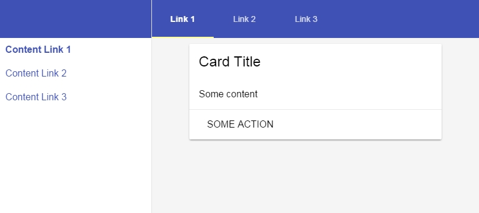

# Komponenten-Entwicklung

Die in den vorangegangenen Kapiteln dargestellte Methoden zum Erstellen einer Komponente mit Hilfe von Polymer werden in diesem Kapitel in einer Beispielimplementierung umgesetzt. Der Abschnitt 7.1 geht dabei auf die Entwicklung der Komponente selbst ein, in Abschnitt 7.2. wird diese mit einer ähnlichen Implementierung der Komponente mit Hilfe von AngularJS verglichen.

## Entwicklung und Deployment einer Polymer-Komponente

Als Beispielimplementierung einer Polymer-Komponente wird eine responsive SPA Navigation mit erster und zweiter Navigationsebene implementiert. Dabei soll sich die zweite Navigationsebene an die Auswahl der ersten Navigationsebene, sowie der Inhalt der Seite an die Auswahl der zweiten Navigationsebene anpassen.

### Entwicklungsumgebung

Für die Entwicklung muss zunächst eine Entwicklungsumgebung eingerichtet werden. Hierzu wird ein Windows-System mit installiertem Node.js gewählt. Für Node werden zusätzlich die Pakete "Grunt", einem automatisierungs-Tool, das Package-Management Tool "Bower", sowie das Scaffolding-Tool "Yeoman" installiert. Als Editor wird Sublime Text in Version 3 verwendet. Zum testen der Komponente wird Chrome 48 eingesetzt.

### Yeoman

Yeoman [citeulike:13916358] ist ein Node CLI-Modul, welches den Entwicklern das Erstellen neuer Projekte unter erleichtert. Mit dessen Hilfe können neue Projekte aus der Kommandozeile heraus erstellt, und die wichtigsten Dateien generiert werden. Es besteht dabei aus drei Werkzeugen, zum einem dem `yo`, welches beim Erstellen eines neuen Projektes hilft und dies beschleunigt, `grunt` und `bower`. Von Polymer wird ein Yeoman-Generator angeboten, welcher einen Generator zum Erstellen eines Polymer-Boilerplates bietet, das sogenannte Seed-Element. Mittels dem Befehl `yo polymer:seed my-element` wird der Generator für das `my-element` gestartet und die HTML-Datei mit der entsprechenden Polymer Grundstruktur generiert (siehe Anhang). Somit kann die Entwicklung der Struktur übersprungen und direkt mit den Funktionalitäten begonnen werden.

### Die multi-navigation-app-Komponente

Nachdem das Seed-Element generiert wurde, wird zunächst das überflüssige HTML-Markup des Templates, die Lifecycle-Callback-Funktionen `attached`und `detached`, sowie die exemplarischen Eigenschaften `fancy`, `author` und die Funktionen `sayHello` und `fireLasers` entfernt, da diese nicht benötigt werden. Nun werden die von der Komponente benötigten HTML Imports für die Elemente `paper-tabs`, `paper-toolbar`, `iron-pages`, `paper-drawer-panel`, `paper-button`, `paper-icon-button`, `paper-card` und `iron-icons` mittels Bower heruntergeladen und in der Komponente importiert. Dabei kann der Import für das `polymer`-Element entfernt werden, da dieser schon in den importierten Elementen vorhanden ist. Nun kann mit dem Aufbau des Layouts der Applikation mittels den `paper`-Elementen begonnen werden.
Als Wrapper für die gesamte Applikation dient das `paper-drawer-panel`-Element, welches die komplette Applikation in einen `Drawer`-Bereich, einer Marginal-Spalte auf der linken Seite, sowie einem `Main`-Bereich, dem Inhalts-Bereich aufteilt. Dem `Main`-Bereich wird nun die erste Navigations-Ebene in Form einer `paper-tabs`-Komponente, welche in einer `paper-toolbar` geschachtelt wird, hinzugefügt. Als Inhalt der `paper-tabs` dient ein `<content>`-Tag-Insertion Point, welcher alle `<paper-tab>`-Elemente des Light DOM selektiert und diese in die Komponente projiziert. Somit können die Navigationspunkte der ersten Ebene von Außerhalb bestimmt und in die Komponente injiziert werden. Diese Navigations-Punkte werden anschließend mit einem `iron-pages`-Element verbunden, welches die mittels einem `<content>`-Tag ausgewählten Inhalte des Light DOM mit der CSS-Klasse `main` in die Komponente injiziert und zwischen diesen umschalten kann. In den `Drawer`-Bereich wir nun, aus optischen Gründen, ebenfalls ein `paper-toolbar`-Element hinzugefügt. Ebenso wie der `Drawer`-Bereich enthält auch der `Main`-Bereich ein `iron-pages`-Element, welches als Inhalt einen `<content>`-Tag enthält, der alle `<iron-selector>`-Elemente des Light DOM selektiert und in die Komponente projiziert. Die Kinder des `<iron-selector>` bilden dabei die zweite Navigations-Ebene. Diese können jegliche Art von `paper`-Elementen oder nativen HTML-Elementen sein, zwischen denen hin- und her- gewechselt werden können soll. Somit kann der Inhalt der gesamten Applikation dynamisch in Form von Kind-Elementen der Komponente übergeben werden. Dabei muss die Struktur des Light DOM jedoch einige Regeln befolgen. Die Elemente der ersten Navigations-Ebene (in der oberen Navigation) müssen `paper-tab` Elemente sein, die Anzahl dieser ist hingegen variabel. Die Elemente der zweiten Navigations-Ebene müssen der Anzahl an Inhalts-Seiten entsprechen und nach Anzahl der Elemente der ersten Navigations-Ebene mittels `iron-selector`-Elementen gegliedert werden. Welche Elemente die Navigationspunkte selbst sind, spielt dabei keine Rolle. Der Inhalt selbst kann mit beliebigen Elementen definiert werden, jedoch muss für jedes Element die Klasse `main` definiert werden.
Damit die Applikation das gewünschte Verhalten aufzeigt wurden die Properties `selectedTop` (das ausgewählte Element der ersten Navigations-Ebene) und `selectedContent` (das ausgewählte Element der zweiten Navigations-Ebene) definiert. Ebenso wurde der `ready`-Callback definiert, welcher beim abgeschlossenen Laden der Komponente die Hilfsfunktionen `_countLinks` und `_addSelectedHandler` ausführt. Die `_countLinks`-Methode ermöglicht es zwischen den übergebenen Links der zweiten Navigations-Ebene zu wechseln, sodass immer der korrekte Inhalt angezeigt wird, wobei die `_addSelectedHandler`-Funktion dieses Verhalten auf die erste Navigations-Ebene abbildet. Sie bedient sich dabei dem automatic node finding um das jeweils aktive Element der Navigationsebenen zu ermitteln. Abschließend werden in dem Template noch einige Style-Regeln definiert, welche die Applikation auf mobilen Geräten funktionsfähig machen und die Oberfläche optimieren. Die fertige Polymer-Komponente wird in Abbildung X dargestellt.

Die Komponente steht unter Versionskontrolle und ist auf GitHub unter der Adresse https://github.com/glur4k/multi-navigation-app sowie im Anhang zu finden. Sie kann nun mittels dem Tag `<multi-navigation-app>` auf allen Webseiten und Applikationen eingebunden werden.

### Deployment mit Bower

Um die Komponente für andere Entwickler verfügbar zu machen, damit diese sie einfach mit `bower install multi-navigation-app` installieren können, muss sie bei Bower registriert werden. Hierfür muss zunächst die `bower.json`-Datei um die korrekten Informationen ergänzt werden, da die Komponente sonst nicht von Bower indiziert werden kann. Entspricht die `bower.json` den Bower-Spezifikationen und wird auf GitHub gepusht, so wird die Komponente mittels dem Befehl `bower register multi-navigation-app git://github.com/glur4k/multi-navigation-app.git` bei Bower registriert. Nach einer kurzen Zeit wird sie von Bower erfasst und ist unter der Adresse `http://bower.io/search/?q=multi-navigation-app` auffindbar. Mittels `bower info multi-navigation-app` kann die aktuelle Version der Komponente auf Bower ermittelt werden, welche dabei immer das aktuellste Release auf GitHub ist. Die Komponente kann nun von allen Entwicklern mittels Bower heruntergeladen und in die eigene Webseite oder Applikation eingebunden werden. Die `bower.json`-Datei ist zusätzlich um den Eintrag `"keywords": [ "web-components" ]` erweitert, somit ist sie ebenso in dem customelements.io Elemente-Katalog unter der Adresse `https://customelements.io/glur4k/multi-navigation-app/` zu finden.
